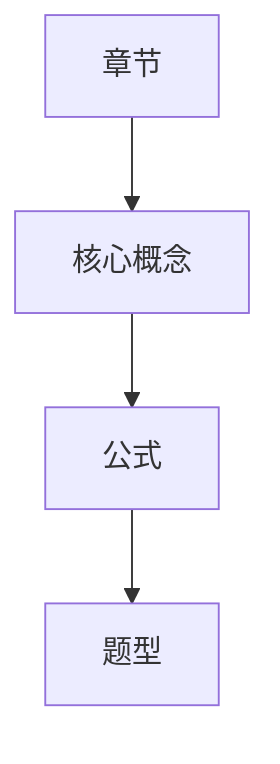

# Output Specification

For a complete final-review pack, generate these artifacts or sections. If the user requests files, use these names.

## 00_期末总复习指南.md

Required sections:

1. 课程资料概况
2. 最高优先级考点
3. 必背公式
4. 高频题型
5. 最容易错的地方
6. 1天冲刺路线
7. 3天复习路线
8. 7天复习路线
9. 建议先做的练习题

## 01_考点清单.md

For each exam point:

- 章节
- 重要程度
- 可能考法
- 一句话解释
- 前置知识
- 来源

## 02_公式表.md

For each formula:

- 公式
- 含义
- 变量
- 适用条件
- 常见错误
- 来源

## 03_练习题题库.md

Group by module/chapter. For each question:

- 题型
- 难度
- 涉及考点
- 来源
- 题目
- 答案, if source-backed
- 解析, if source-backed
- duplicate group, if applicable

## 04_高频题型.md

For each pattern:

- 出现次数
- 关联考点
- 常见问法
- 典型题
- 变式题
- 常见错误
- 复习建议

## 05_模拟卷A.md and 06_模拟卷A_答案解析.md

Structure:

1. 选择题
2. 填空题
3. 判断题, if relevant
4. 计算题
5. 简答题
6. 证明/设计/综合题, if relevant

Rules:

- Prefer source exercises and variants.
- If question supply is insufficient, add concept questions labeled `AI生成题`.
- Keep answers separate when requested.

## 07_错题本模板.md

Include a reusable table:

| 日期 | 题目来源 | 题型 | 错因 | 正确思路 | 复盘日期 |
|---|---|---|---|---|---|

Also include common error categories.

## 08_Anki卡片.csv

Fields:

```csv
front,back,tags,source
```

Card types:

- concept
- formula
- common-mistake
- short-answer
- question-pattern

## 09_知识图谱.md

Use Markdown plus Mermaid:



Show relationships among chapters, concepts, formulas, and question types.

## 10_复习计划.md

Support 1-day, 3-day, 7-day, and custom-day plans.

Prioritize by:

- exam point importance
- exercise frequency
- teacher emphasis
- formula density
- difficulty

## 11_资料完整性检查.md

Include:

- missing chapters/material types
- OCR or parse problems
- missing answers/explanations
- low-quality or duplicate files
- suggested files to add
- chapters needing special attention
